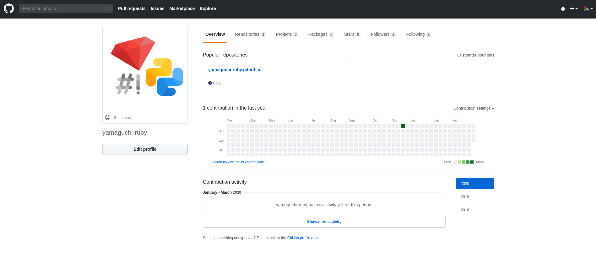
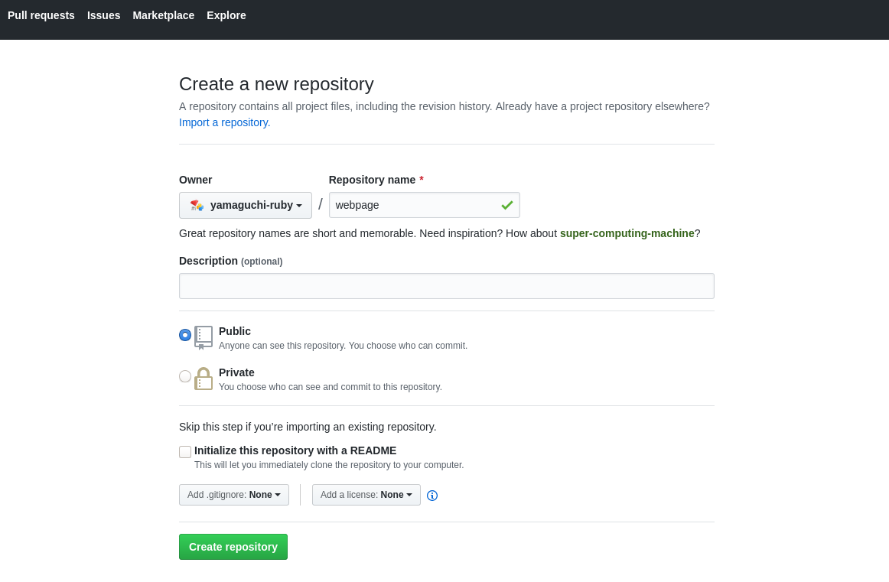
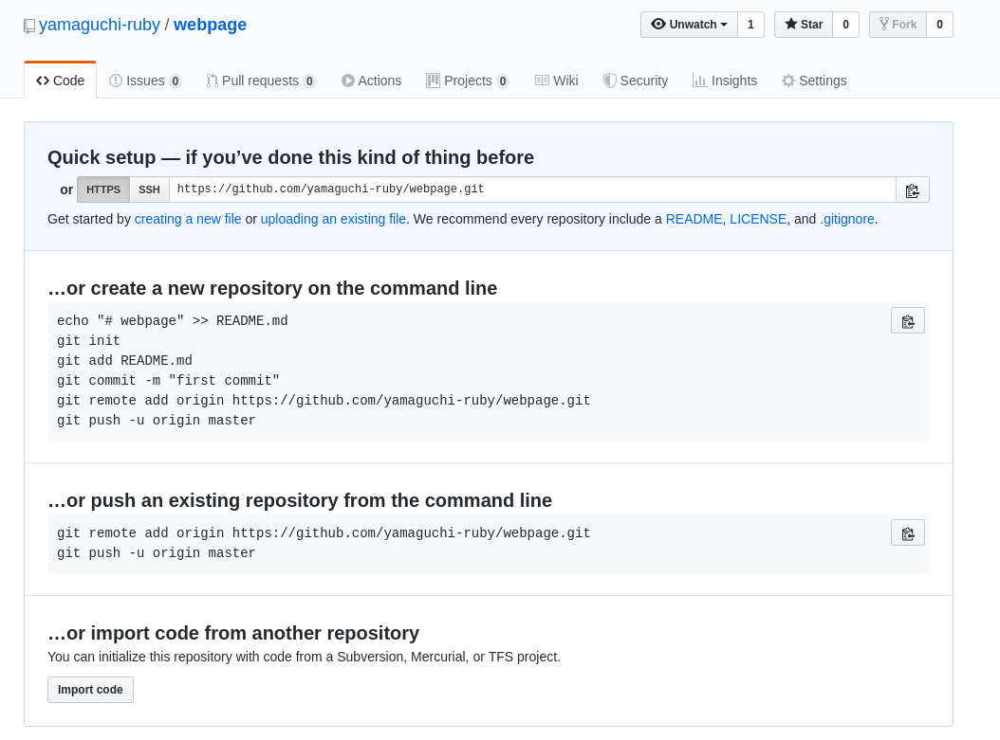
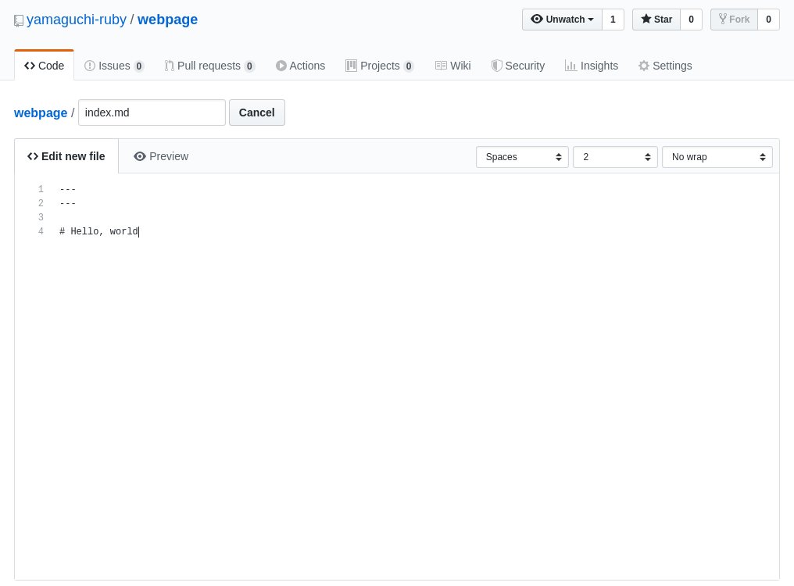
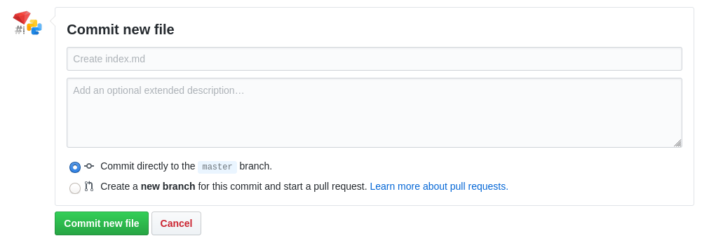
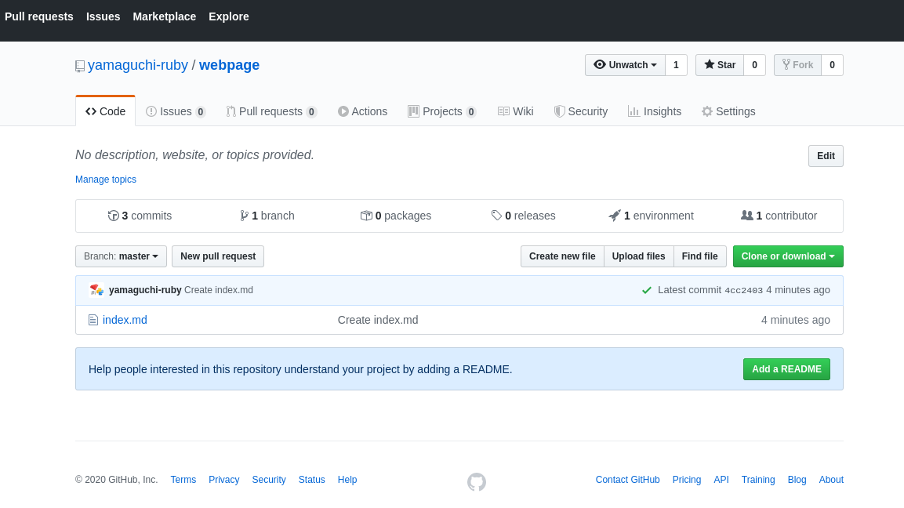
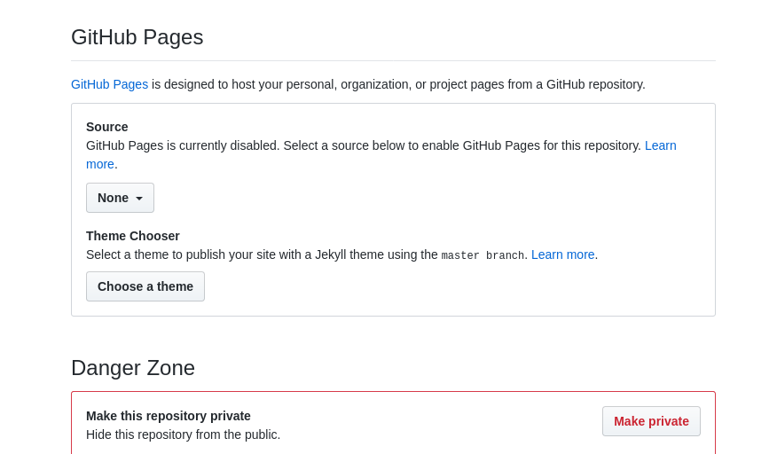
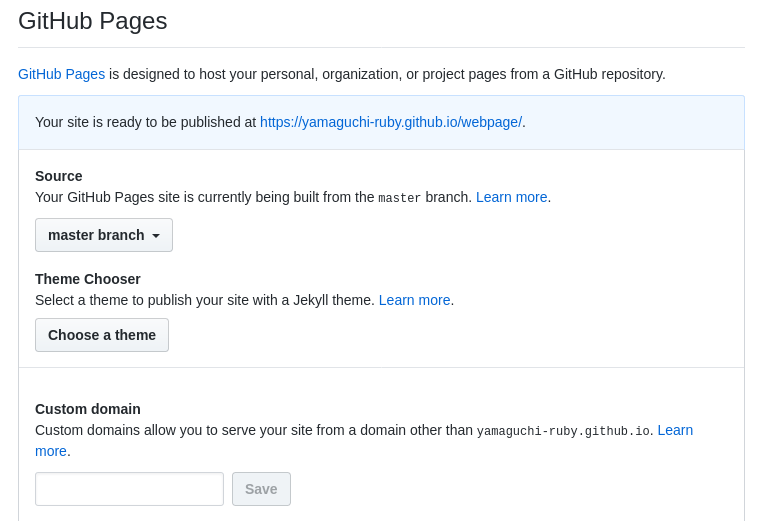

# Hello, Worldを作ってみる

## 右上にある「✚」をクリックする


## **Repository name** に適当に名前を決めて文字列を入れ、[Create repository]をクリックする


## **creating a new file** をクリックする


## 画像のように入力する


```md
---
---

## Hello, world
```

## [Commit new file]をクリックする


## ⚙Settings をクリックする


## スクロールしていき、GitHub Pagesの項目があるので、そこの**None**を**Master Branch**に変更する


## 5分ほど待って、Your site is ready to be published at ... にあるリンクをクリックする


## ページが出来上がる


# [ウェブページを作ってみよう](./)