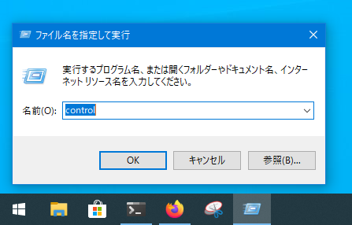
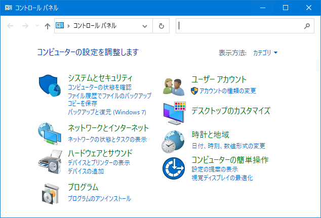
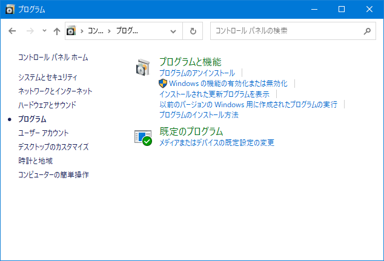
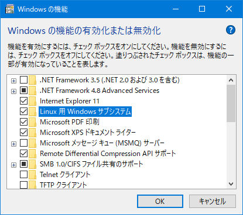
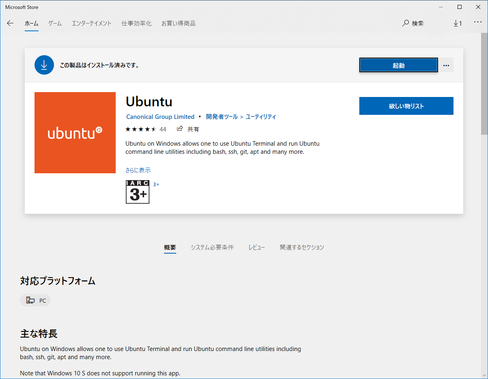
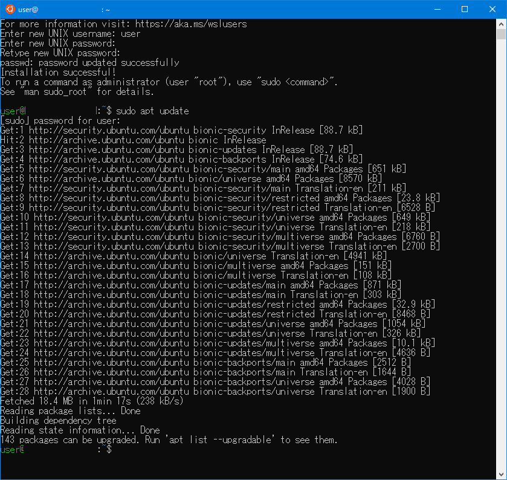

# WSLを有効にする

Windowsキー＋Rもしくはスタートボタン右クリックで
「ファイル名を指定して実行」を開く。

次に、`control`と入力し「OK」をクリックする。



「プログラム」をクリックする。



「Windows の機能の有効化または無効化」をクリックする。



「Linux 用 Windows サブシステム」にチェックを入れ、
「OK」をクリックして再起動する。



スタートメニューから「Microsoft Store」を開き、
「Ubuntu」をインストールする。



Ubuntuがインストールされた後、スタートメニューからUbuntuを起動する。

起動時にユーザー名とパスワードを訊かれるので、
ユーザー名とパスワードを登録する。(パスワードは確認のため2回訊かれる)



パッケージのアップデートとアップグレードを行う。

```sh
sudo apt update
sudo apt upgrade
```