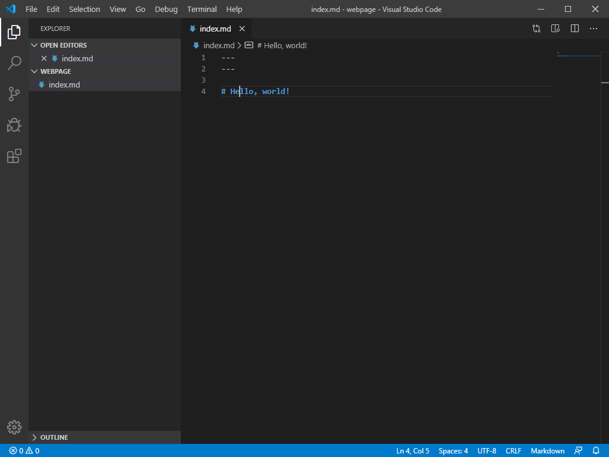
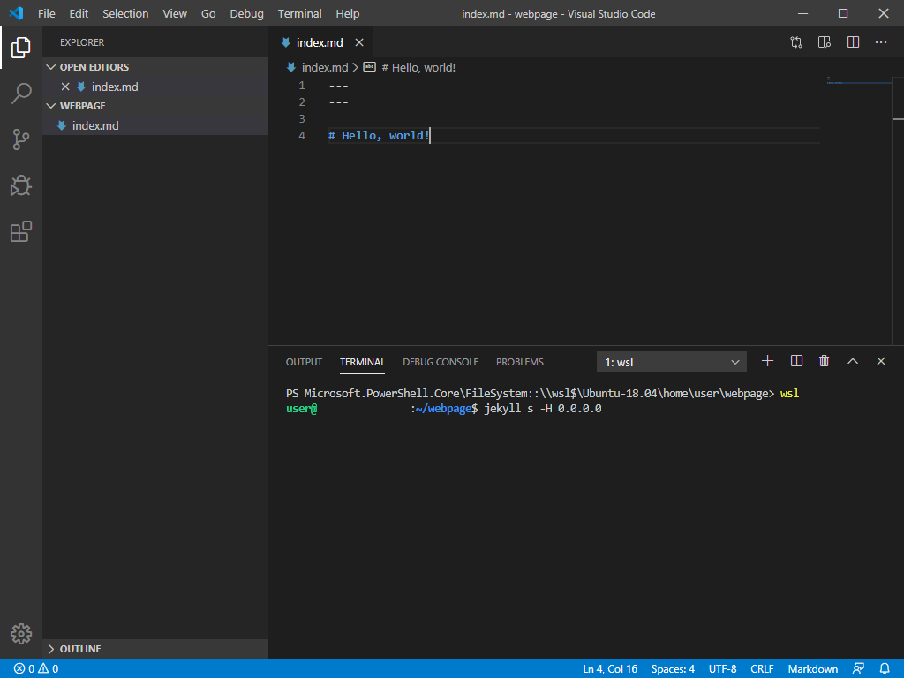
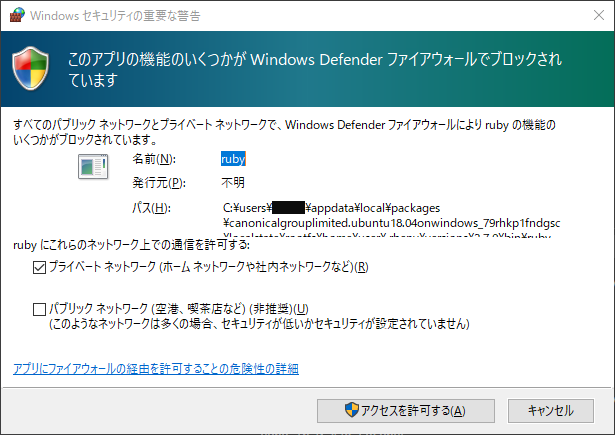
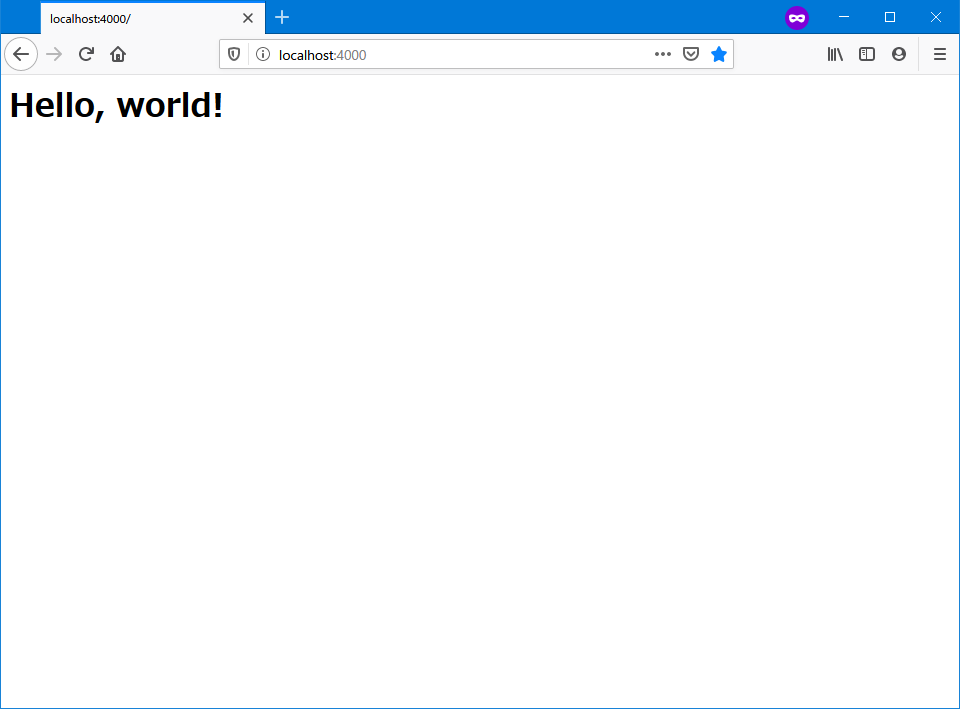

# 概要
Jekyllでウェブページを作成し、GitHub Pagesを利用して公開することについての説明。

# 必要なもの
- Windows 10 (WSL) または Ubuntu
- エディター
- GitHub
- Ruby
- jekyll

## Windows 10 の場合
WSLをインストールする。
([WSLのインストール方法](../install_wsl/))

## Ruby をインストールする
Rubyをインストールする([Ruby のインストール方法](../2019/11/18/085538.html))

## エディターを準備する
ウェブページを作るためにエディターが必要。
Windows標準のメモ帳でも使えないこともないが使いにくいため使いやすいエディターをインストールする必要がある。

[Visual Studio Code](//code.visualstudio.com/)などのエディターをダウンロードしてインストールする。
(Windows の場合は Path を通して再起動する。)

Windowsの場合はWindowsにインストールする。

## Jekyll をインストールする
```sh
sudo apt install g++ -y
gem install jekyll
```

Windowsの場合はWSLのUbuntu上で実行する。

## GitHub に登録する
ウェブページを公開するために普通はサーバーが必要だが、
サーバーの管理やセキュリティー上難易度が高いので、この記事ではGitHub Pagesを利用する。
このGitHub Pagesを利用するためにはGitHubに登録する必要がある。

[GitHub](//github.com)に登録することでウェブページを公開することができる。

# Github Pages チュートリアル
[GitHub Pagesを使ってみる](use_githubpages.html)(飛ばしても良い)

# 作業ディレクトリーを作る
作業ディレクトリー(ウェブページのフォルダー)を作る。

```sh
mkdir ~/webpage
cd ~/webpage
explorer.exe . # WSL on Windows の場合
```

# Jekyll を使う
Jekyllとは
:   Webサイトのテンプレートからウェブサイトを作るサイトジェネレーター
    GitHub Pages はJekyllを使用している。

詳しくは、[Jekyllの主な機能](jekyll-details.html)を参照。

# Visual Studio Code で作業ディレクトリーを開く
```sh
cd ~/webpage
code .
```

# Jekyll で Hello, world!

`index.md` を作成して、
```markdown
---
---

# Hello, world!
```

と書いて保存。



メニューにある「Terminal」を開く。



WSLを起動し、作業ディレクトリーに入り、jekyllを起動する。

```sh
wsl
cd ~/webpage
jekyll s -H 0.0.0.0
```


Windows の場合、ファイアーウォールでアクセス許可を求められるので、「アクセスを許可する」をクリックして許可する。



ブラウザを開き、`localhost:4000`と入力すると、
作成したウェブページが表示される。



# git を init して GitHub に push する
1. 右上の✚をクリックして、New repositoryをクリックする。
1. Repository name に <githubのユーザー名>.github.io を入力する。
1. 以下のコマンドを入力する。(Visual Studio Code 上の Terminal で行う)
```sh
git init
git commit -m "first commit"
git remote add origin https://github.com/<GitHub のユーザー名>/<リポジトリー名>.git
git push -u origin master
```
名前・メールアドレスを登録していない場合は、
```sh
git config --global user.name "名前"
git config --global user.email "メールアドレス"
```
を実行しておく。
1. 「Settings」を開き、「GitHub Pages」の「None」を「Master Branch」に変更する。
1. 5分待って、リンクが出るのでクリックするとウェブページを表示できる。

GitHubの操作がわからない場合は、[GitHub Pages を使ってみる](use_githubpages.html)を参照。

# Jekyll のテンプレートを作る

作業ディレクトリーに`_layouts`ディレクトリーを作成して、`template.html`ファイルを作成する。
この、`template.html`が雛形となる。

    

```html
<!-- _layouts/template.html -->
<!doctype html>
<html>
    <head>
        <meta charset="utf-8">
    </head>
    <body>
        {{ c }}
    </body>
</html>
```

# 作成した雛形を使い、ページを作成する。

`layout: `で設定する文字は`_layouts/`の雛形のファイル(拡張子を除く)である。

```markdown
<!-- test.md -->
---
layout: template
---

# Hello, world
```

`test.md`から生成される[test.html](test.html)はリンク先のように表示される。

