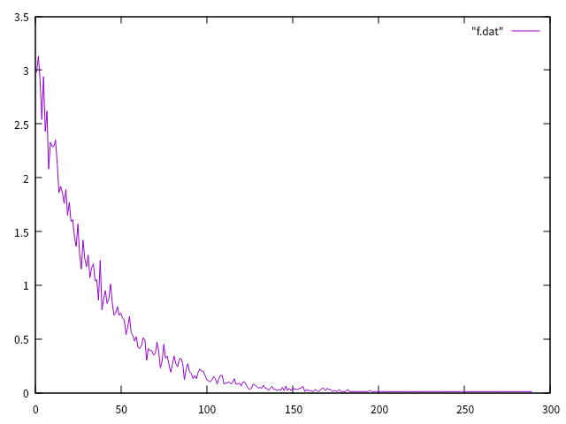

# 概要
ガチャで何回引けばレアが出るかのシミュレーションをしてみる。

条件は、

- ソーシャルゲームのように何回引いても確率はわからない
- レアが出る確率は3%
- 乱数で確率が決まる

# プログラム

```ruby
# ruby 2.7.0
class Statistics < Array
    def mean # 平均
        1.0 * self.sum / self.size
    end

    def var # 分散
        avg = self.mean
        Statistics.new self.size do |i|
           (self[i] - avg) ** 2
        end
        .mean
    end

    def sd # 標準偏差
        Math.sqrt(var)
    end
end

def func
    1000.times do |i|
        if rand * 100 < 3
            return i+1
        end
    end
end

ary = Statistics.new
10000.times do |i|
    ary[i] = func
end

puts "レアが3%の確率で排出されるガチャは平均#{"%.1f" % ary.mean}回で出て、標準偏差は#{"%.1f" % ary.sd}。"

hash = {}
ary.each do |e|
    hash[e] = 0 unless hash[e]
    hash[e] += 1
end

open "f.dat", "w" do |f|
    hash.sort.each do |key, value|
        f.puts "#{key} #{value / 100.0}"
    end
end
```

# 結果
レアが3%の確率で排出されるガチャは平均33.1回で出て、標準偏差は32.1。

平均から30連して出るかな？ってくらい。

グラフにすると、



グラフから3%でレアの出るガチャが単発で出る確率は3%くらい。